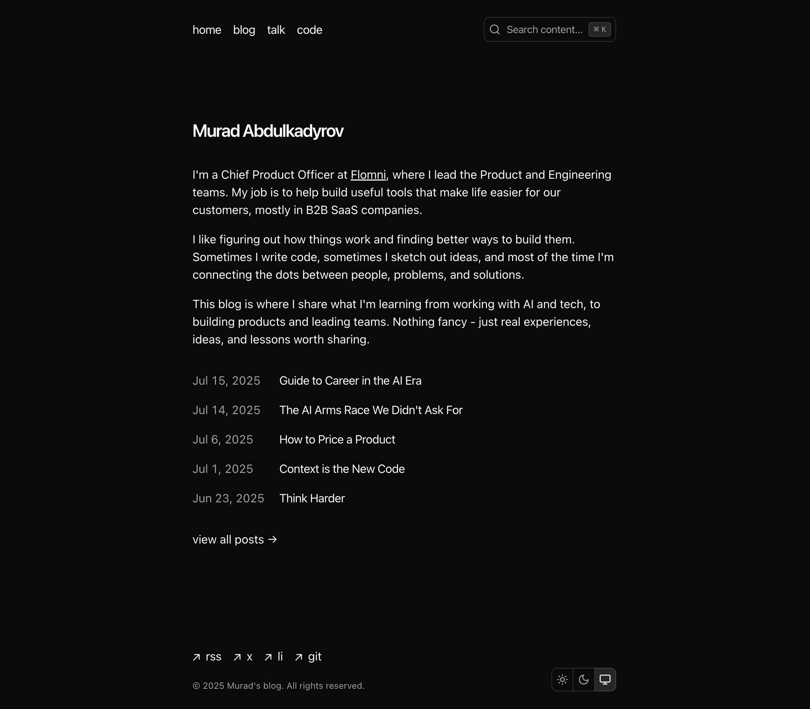

<a href="https://murabcd.vercel.app">
  
  <h1 align="center">Blog</h1>
</a>

<p align="center">
  Blog Built with Next.js and Convex.
</p>

<p align="center">
  <a href="#features"><strong>Features</strong></a> ·
  <a href="#running-locally"><strong>Running locally</strong></a> ·
  <a href="#license"><strong>License</strong></a>
</p>
<br/>


## Features

- [Next.js](https://nextjs.org) App Router
  - Advanced routing for seamless navigation and performance
- [TailwindCSS](https://tailwindcss.com/):
  - A utility-first CSS framework for rapidly building custom designs
- [MDX](https://mdxjs.com/)
  - Write JSX in your Markdown documents for interactive components and dynamic content
- [Vercel Blob](https://vercel.com/docs/storage/vercel-blob):
  - For storing and serving images
- [Convex](https://www.convex.dev/)
  - Real-time database for storing like counting and visitor interactions


## Running locally

You will need to use the environment variables [defined in `.env.example`](.env.example) to run OpenChat. It's recommended you use [Vercel Environment Variables](https://vercel.com/docs/projects/environment-variables) for this, but a `.env` file is all that is necessary.

> Note: You should not commit your `.env` file or it will expose secrets that will allow others to control access to your various OpenAI and authentication provider accounts.

1. Install Vercel CLI: `bun i -g vercel`
2. Link local instance with Vercel and GitHub accounts (creates `.vercel` directory): `vercel link`
3. Download your environment variables: `vercel env pull`

```bash
bun install
bun dev
```

Your app should now be running on [localhost:3000](http://localhost:3000/)


## License

You are free to use this code as inspiration. Please do not copy it directly. Crediting the author is appreciated.
